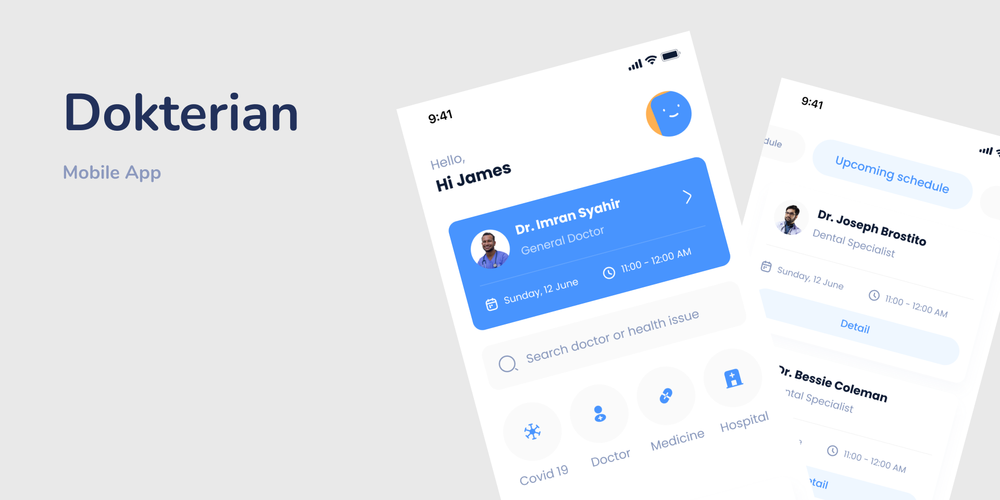

# 📱 React Native Tutoriais

Bem-vindo ao repositório de **Tutoriais para Aplicações React Native**! 🚀

Aqui você encontrará **aplicações completas** desenvolvidas com **boas práticas**, integração de bibliotecas e construção de layouts. Cada aplicação explora diferentes camadas da arquitetura, desde a interface até a comunicação com APIs e gerenciamento de estado.

## 📂 Estrutura das Aplicações

Cada aplicação neste repositório aborda um cenário específico e demonstra como utilizar bibliotecas populares para React Native.

### 🔹 **Dokterian**

[](./Dokterian)

### 🔹 **Healtec**

[](./Healtec)

### 🔹 **Login Animated**

<a href="./LoginAnimated">

</a>

### 🔹 **Onboarding**

<a href="./Onboarding">

</a>

### 🔹 **Dark/Light Mode Animated**

<a href="./DarkLightAnimated">

</a>

### 🔹 **Lock Flow**

<a href="./LockFlow">

</a>


## 🛠️ Como Utilizar
Cada aplicação neste repositório serve como referência para implementação de funcionalidades no React Native.
1. Clone este repositório:
   ```sh
   git clone https://github.com/leandro-mancini/react-native-tutorials.git
   ```
2. Acesse a pasta da aplicação desejada e explore o código-fonte.
3. Utilize as ideias e padrões apresentados para aprimorar seus projetos.

## 💡 Contribuindo
Se quiser contribuir com novas aplicações ou melhorias, abra um **pull request** ou uma **issue**.

📌 **Código bem estruturado e modular facilita a escalabilidade e manutenção.**
